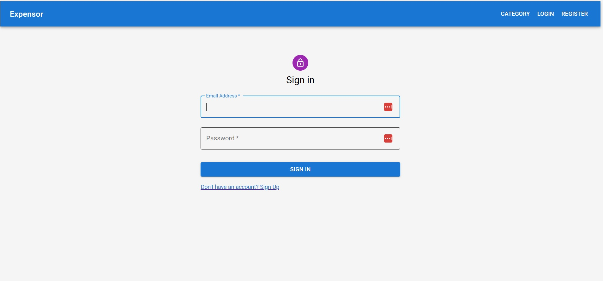
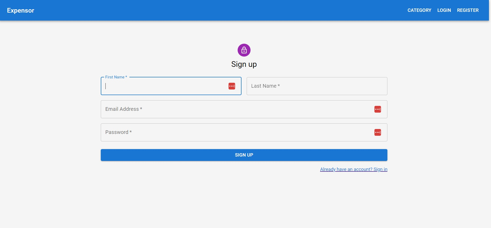
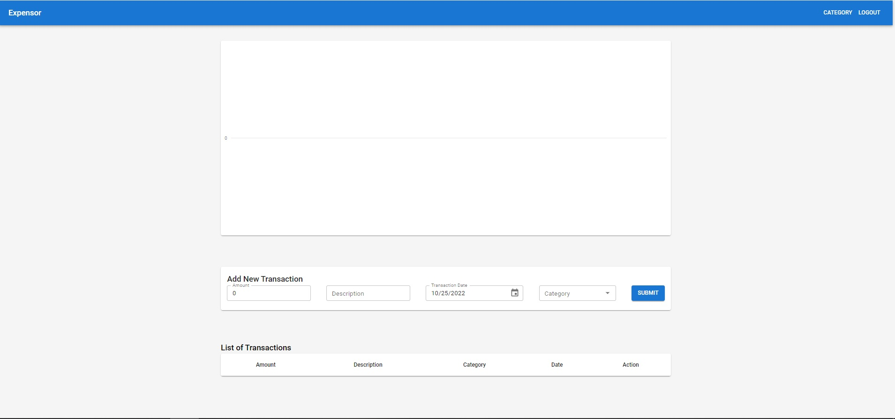
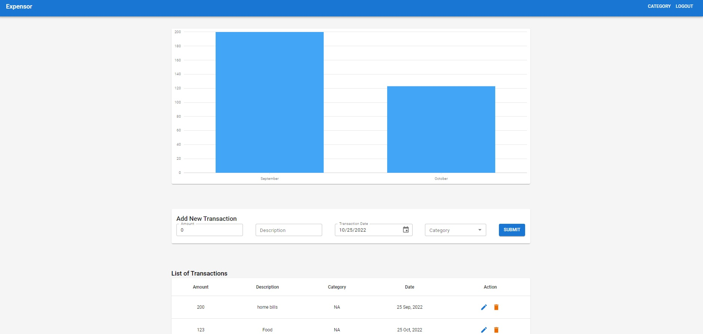

<h1 align="center"><i>Expensor</i></h1>

**_
Expensor is application for tracking expenses. An unlimited number of users can be registered and each user can add new categories of expense sources. A graph of expenses by month is also made, and each entry can be adjusted or deleted.
_**

    

    <h2 align="center">Login</h2>
    
    

    <h2 align="center">Register</h2>
    
    

    <h2 align="center">Home</h2>
    
    

    <h2 align="center">Some expenses</h2>
    
    

   <h2 align="center">The repo includes the "<i>back-end</i>" and the "<i>front-end</i>" of the app.</h2>

<h2>Setup:</h2>
<h3>For server side is used NodeJs with Express</h3>
<h4>To start: npm run serve</h4>

<h3>For client side is used React framework with Redux</h3>
<h4>To start: run npm start</h4>

Used features of the platform:

- <i><b>Responsive Design</b></i>
- <i><b>Home page with </b></i>
- <i><b>Authentication (Register, Login)</b></i>
- <i><b>Add expense</b></i>
- <i><b>Update expense</b></i>
- <i><b>Delete expense</b></i>

Used technologies:

- <i><b>JavaScript with React library</b></i>
- <i><b>Redux</b></i>
- <i><b>HTML</b></i>
- <i><b>CSS</b></i>

Dependencies, (besides Create-React-App deps): 

- React Router v6
- js-cookie
- mayterial ui
- dayjs
- jsonwebtoken
- mongoose
- nodemon

